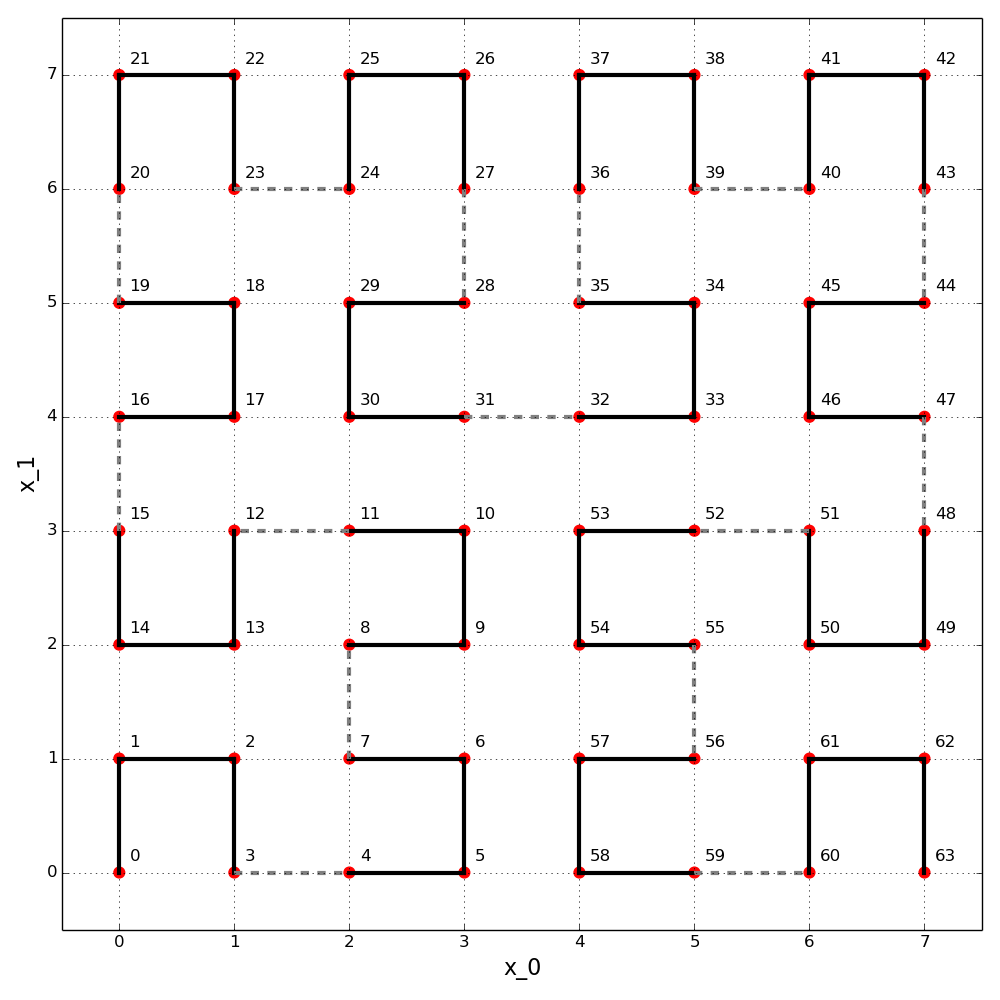

Introduction
============

This is a module to convert between one dimensional distance along a
`Hilbert curve`_ (:math:`d`)and N-dimensional coordinates.  The two important
parameters are :math:`N` (the number of dimensions, must be > 0) and :math:`p`
(the number of iterations used in constructing the Hilbert curve, must be > 0).

We consider an :math:`N`-dimensional `hypercube`_ of side length :math:`2^p`.
This hypercube contains :math:`2^{N p}` unit hypercubes (:math:`2^p` along
each dimension).  The number of unit hypercubes determine the possible
discrete distances along the Hilbert curve (indexed from :math:`0` to
:math:`2^{N p} - 1`).  The image below illustrates the situation for
:math:`N=2` and :math:`p=3`.

   This is the third iteration (:math:`p=3`) of the Hilbert curve in two
   (:math:`N=2`) dimensions.  Distances, :math:`d`, along the curve are
   labeled from 0 to 63 (i.e. from 0 to :math:`2^{N p}`).  The provided
   functions translate between :math:`N`-dimensional coordinates and the one
   dimensional distance.  For example, between (:math:`x_0=4, x_1=6`) and
   :math:`d=36`.

Reference
=========

This module is based on the C code provided in the 2004 article
"Programming the Hilbert Curve" by John Skilling,

  - http://adsabs.harvard.edu/abs/2004AIPC..707..381S

I was also helped by the discussion in the following stackoverflow post,

  - `mapping-n-dimensional-value-to-a-point-on-hilbert-curve`_

which points out a typo in the source code of the paper.  The Skilling code
provides two functions ``TransposetoAxes`` and ``AxestoTranspose``.  In this
case, Transpose refers to a specific packing of the integer that represents
distance along the Hilbert curve (see below for details) and
Axes refer to the N-dimensional coordinates.  Below is an excerpt of the docs
from that code that appears in the paper by Skilling, ::

//+++++++++++++++++++++++++++ PUBLIC-DOMAIN SOFTWARE ++++++++++++++++++++++++++
// Functions: TransposetoAxes  AxestoTranspose
// Purpose:   Transform in-place between Hilbert transpose and geometrical axes
// Example:   b=5 bits for each of n=3 coordinates.
//            15-bit Hilbert integer = A B C D E F G H I J K L M N O is stored
//            as its Transpose
//                   X[0] = A D G J M                X[2]|
//                   X[1] = B E H K N    <------->       | /X[1]
//                   X[2] = C F I L O               axes |/
//                          high  low                    0------ X[0]
//            Axes are stored conveniently as b-bit integers.
// Author:    John Skilling  20 Apr 2001 to 11 Oct 2003

.. _Hilbert curve: https://en.wikipedia.org/wiki/Hilbert_curve
.. _hypercube: https://en.wikipedia.org/wiki/Hypercube

.. _mapping-n-dimensional-value-to-a-point-on-hilbert-curve: http://stackoverflow.com/questions/499166/mapping-n-dimensional-value-to-a-point-on-hilbert-curve/10384110#10384110
